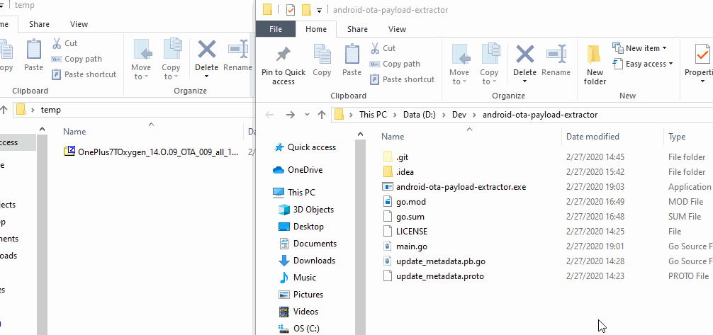

# Android OTA 镜像解压工具

Go 编写的 Android OTA 镜像解压工具

[下载](https://github.com/tobyxdd/android-ota-payload-extractor/releases)

## 使用方法

### 命令行

```
./android-ota-payload-extractor <OTA.zip or payload.bin> [(optional) file to extract 1] [(optional) file to extract 2] ...
```

样例（从 raven-ota.zip 解压 boot 和 vendor）：

```
./android-ota-payload-extractor.exe raven-ota.zip boot vendor
```

支持单独解压出来的 payload.bin，也支持直接用整个 ROM zip 包。

如果没有指定要解压的文件，默认会解压 payload 中包含的所有文件。



## About

灵感基于： https://github.com/cyxx/extract_android_ota_payload

从 Android OTA 解包镜像文件有很多用途。例如对于没有 TWRP 设备，想要刷 Magisk 就需要拿到 ROM 的 boot.img 打补丁后刷回去。但此前 Python 编写的提取工具需要配置 Python 环境，对于没经验的 Windows 用户来说比较复杂。

本项目是一个性能更高的跨平台镜像解压工具，无需安装配置任何第三方依赖。将 payload 或 zip 拖到程序上即可。